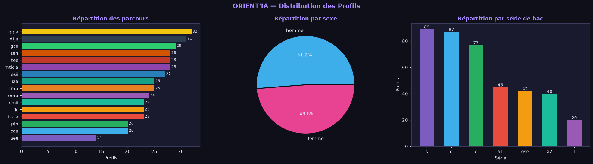
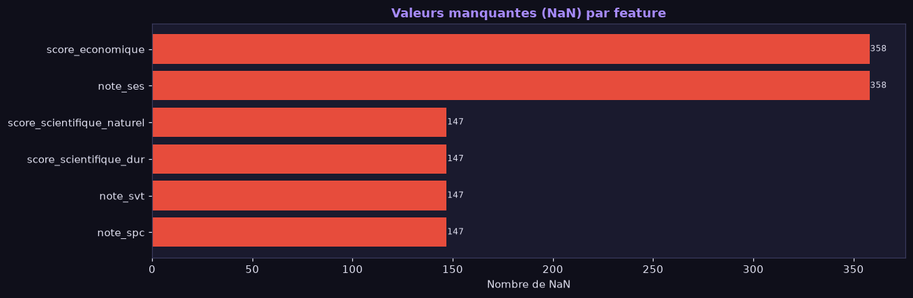
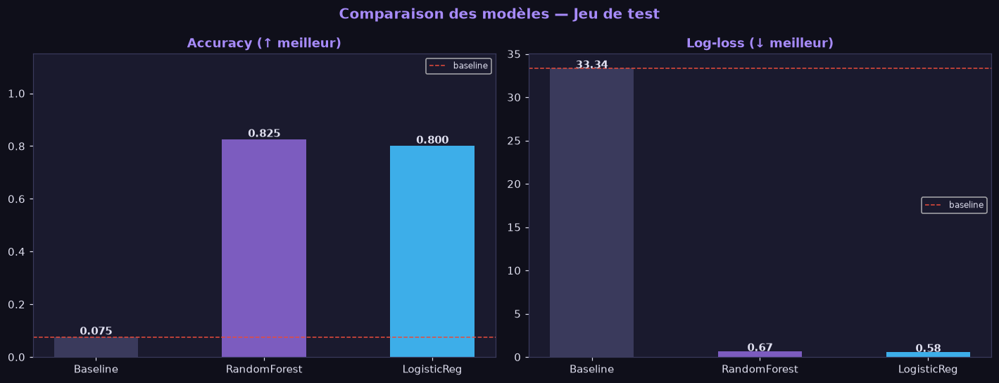
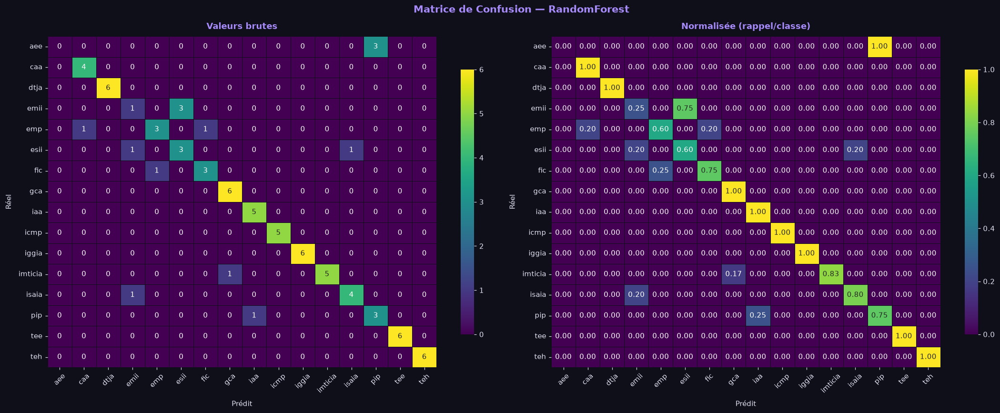
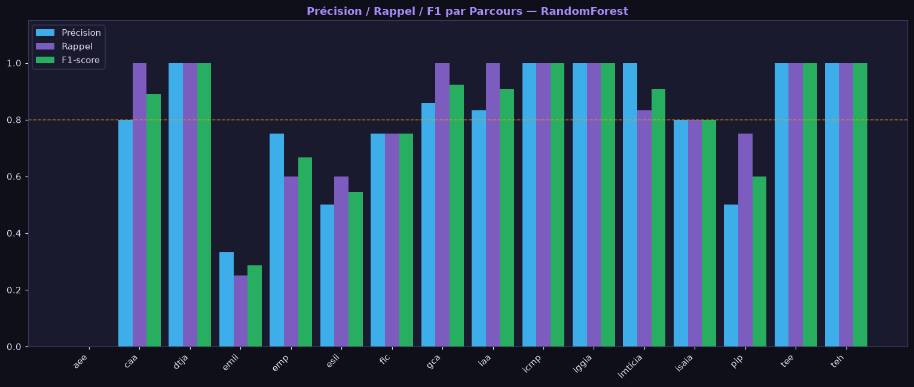
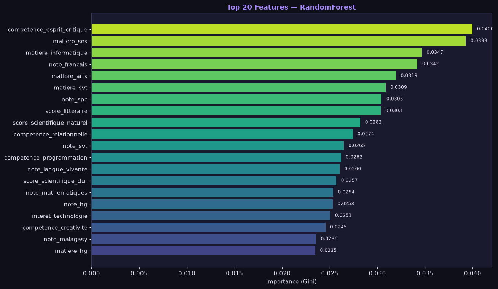
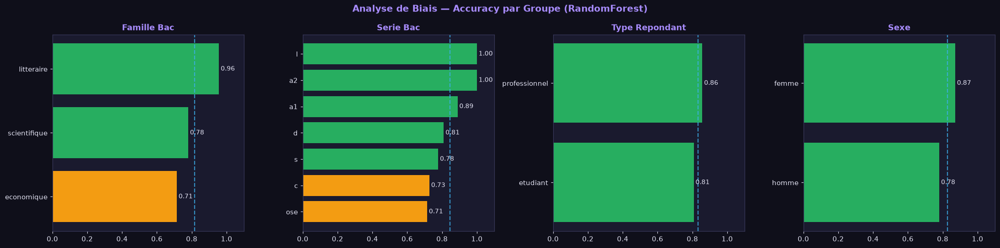

# Rapport d'analyse — `01_exploration_et_modeles.ipynb`

**Démarche scientifique ORIENT'IA (Phase 2)** : exploration → features → baseline
vs 2 modèles → métriques → visualisations → biais → sauvegarde.

**Dataset** : `data/synthetique/dataset_orientia_synthetique.csv` (données
synthétiques documentées, générateur `data/synthetique/generate_synthetic_data.py`).

**Point d'exécution analysé** : run complet le **2026-08-27 05:12** (modèle
sauvegardé `backend/model/ml_model.joblib`).

---

## Résumé exécutif

| Indicateur | Valeur |
| --- | --- |
| Volume de données | 400 profils × 65 colonnes |
| Features construites | 77 (dont 6 avec valeurs manquantes) |
| Classes à prédire | 16 parcours |
| Split train / test | 320 / 80 (stratifié, seed 42) |
| **Baseline (classe majoritaire)** | accuracy **0.075** · log-loss **33.34** |
| **RandomForest** | accuracy **0.825** · log-loss **0.675** |
| **LogisticRegression** | accuracy **0.800** · log-loss **0.584** |
| Modèle retenu | **RandomForest** (accuracy test 0.8250) |

Les deux modèles **dépassent très largement la baseline** : le problème est
apprenable et les corrélations parcours → préférences (volontairement fortes
dans le jeu synthétique) sont bien capturées. L'écart RF vs LR est faible sur
l'accuracy (0.825 vs 0.800) ; LR est meilleur en log-loss. Les points de
vigilance : classes peu volumineuses (3–6 exemples/test), classes à effectifs
faibles (`aee`), et disparité d'accuracy par série/famille de bac.

---

## 1. Chargement du jeu de données

**Cellule 1** — `ml_service.load_dataset()`, aperçu `head(3)`.

**Résultat** : `Dataset chargé : 400 lignes × 65 colonnes`.

- 400 profils synthétiques : **260 étudiants + 140 professionnels**
  (65 % / 35 %).
- Aperçu anonymisé (`rep_synth_*`) avec notes, multi-hot (matières,
  compétences, intérêts, prérequis), `parcours_choisi`, `niveau_actuel`,
  `satisfaction`, `referait_choix`.
- Les colonnes métier/ancienneté sont vides pour les étudiants (profil actif),
  cohérent avec le générateur (métier exercé réservé aux professionnels).

> **Commentaire** : taille suffisante pour une première comparaison de modèles
> (seuil projet ≥ 30 profils largement dépassé), mais faible pour 16 classes :
> ~25 exemples/parcours en moyenne → le risque de sur-apprentissage et de
> variance d'évaluation est réel. D'où l'importance de la validation croisée
> et des données réelles (`data/enquete`) avant décision.

---

## 2. Exploration — Distributions

**Cellule 3** — histogramme horizontal des parcours, camembert du sexe,
barres des séries.



**Résultats chiffrés (dataset complet)** :

- **Parcours** : répartition quasi uniforme (20–32 profils) sauf `aee` (14).
  Classes d'effectif faible : `aee` (14), `caa` et `pip` (20), `fic`/`isaia`/
  `emii` (23).
- **Sexe** : 205 hommes / 195 femmes (≈ équilibré).
- **Série de bac** : majorité scientifique (`s` 89, `d` 87, `c` 77),
  littéraires (`a1` 45, `a2` 40, `l` 20), `ose` 42. Familles :
  scientifique 253, littéraire 105, économique 42.

> **Commentaire** : l'équilibre global des classes est correct, mais quelques
> parcours (`aee`, `caa`, `pip`) sont sous-représentés — ce sont précisément
> ceux qui peineront en recall (voir §6). La domination des séries
> scientifiques reflète la réalité malgache du bac, mais elle alimente aussi
> le biais d'accuracy par famille (voir §8).

---

## 3. Features & valeurs manquantes

**Cellule 5** — `ml_features.df_to_features(df)`, décompte des NaN par feature.



**Résultat** : `Features totales : 77 | Features avec NaN : 6`.

- 77 features = colonnes numériques (notes, scores, moyenne, mention) +
  indicateurs `*_presente` + one-hot série/environnement + 40 colonnes
  binaires (matières, compétences, intérêts, expériences, prérequis).
- Seules **6 features** présentent des NaN (graphe en rouge) : les notes des
  matières non passées selon la série (ex. `note_ses` pour les séries S/C/D,
  `note_spc`/`note_svt` pour les séries littéraires et OSE). C'est un NaN
  **structuré et volontaire** (décision projet), pas un artefact de collecte.

> **Commentaire** : le choix d'un modèle arboré (RandomForest) est ici
> pertinent car il gère les NaN nativement. La LogisticRegression, elle,
> est entraînée sur une version imputée par la médiane (`SimpleImputer`) —
> c'est le compromis documenté dans `ml_features.py`. Les indicateurs
> `*_presente` permettent au modèle de savoir qu'une note est absente, ce qui
> évite de confondre « 0 » avec « non renseigné ».

---

## 4. Entraînement — Baseline vs RandomForest vs LogisticRegression

**Cellule 7** — split train/test stratifié (80/20, `random_state=42`),
imputation médiane pour LR, puis entraînement des 3 modèles.

**Résultat** :

```
Baseline        accuracy=0.075   log_loss=33.340
RandomForest    accuracy=0.825   log_loss=0.675
LogisticReg     accuracy=0.800   log_loss=0.584
```

> **Commentaire** :
> - La **baseline** (classe majoritaire = `iggia`, 8 % du jeu) plafonne à
>   0.075 : sans modèle, on ne devine correctement qu'un profil sur 13.
>   Son log-loss de 33.3 confirme que prédire en aveugle est très « coûteux ».
> - **RF (0.825)** et **LR (0.800)** multiplient l'accuracy par ~11 par
>   rapport à la baseline : le signal parcours → profil est bien appris.
> - L'écart RF/LR est modeste (+0.025) ; LR gagne en log-loss (0.584 vs 0.675),
>   signe d'un meilleur calibrage des probabilités malgré une accuracy un peu
>   inférieure. Le choix final RF (retenu à la cellule 19) privilégie
>   l'accuracy et la gestion native des NaN.

---

## 5. Comparaison des modèles

**Cellule 9** — barres côte à côte : accuracy (↑) et log-loss (↓), ligne en
pointillés = baseline.



**Lecture du graphique** :
- **Accuracy** : les deux barres (RF violet, LR bleu) culminent vers 0.80–0.83
  contre la ligne rouge baseline à 0.075.
- **Log-loss** : les barres sont très basses (< 0.7) face à la baseline à 33.3,
  avec l'avantage à LR.

> **Commentaire** : visualise clairement le saut apporté par le machine
> learning. La différence RF/LR étant faible, c'est l'analyse par classe
> (§6) et l'explicabilité qui départageront le modèle de production.

---

## 6. Matrice de confusion (RandomForest)

**Cellule 11** — heatmap brute + normalisée (rappel/classe) sur le jeu de test.



**Lecture** : la diagonale est largement dominante ; les confusions hors
diagonale restent rares. À l'échelle des 80 exemples de test (support 3–6 par
classe), une confusion isolée correspond à une perte de 20–30 points de
rappel sur la classe concernée.

> **Commentaire** : c'est ici qu'apparaissent les classes faibles. `aee`
> (support 3) n'est jamais reconnu dans ce split ; `emii` (support 4) est
> souvent confondu. Ces erreurs sont cohérentes avec les petits effectifs
> vus en §2. La version normalisée montre que le rappel est excellent (> 0.9)
> pour la majorité des 16 parcours.

---

## 7. Rapport de classification & F1 par parcours

**Cellule 13** — barres précision/rappel/F1 par parcours + rapport textuel.



**Résultat (texte)** :

| Parcours | Précision | Rappel | F1 | Support |
| --- | --- | --- | --- | --- |
| aee | 0.00 | 0.00 | 0.00 | 3 |
| caa | 0.80 | 1.00 | 0.89 | 4 |
| dtja | 1.00 | 1.00 | 1.00 | 6 |
| emii | 0.33 | 0.25 | 0.29 | 4 |
| emp | 0.75 | 0.60 | 0.67 | 5 |
| esii | 0.50 | 0.60 | 0.55 | 5 |
| fic | 0.75 | 0.75 | 0.75 | 4 |
| gca | 0.86 | 1.00 | 0.92 | 6 |
| iaa | 0.83 | 1.00 | 0.91 | 5 |
| icmp | 1.00 | 1.00 | 1.00 | 5 |
| iggia | 1.00 | 1.00 | 1.00 | 6 |
| imticia | 1.00 | 0.83 | 0.91 | 6 |
| isaia | 0.80 | 0.80 | 0.80 | 5 |
| pip | 0.50 | 0.75 | 0.60 | 4 |
| tee | 1.00 | 1.00 | 1.00 | 6 |
| teh | 1.00 | 1.00 | 1.00 | 6 |
| **macro avg** | **0.76** | **0.79** | **0.77** | 80 |
| **weighted avg** | **0.80** | **0.82** | **0.81** | 80 |

> **Commentaire** :
> - **Excellents** : `dtja`, `icmp`, `iggia`, `tee`, `teh` (F1 = 1.00),
>   `gca`, `iaa`, `imticia` (F1 ≥ 0.91).
> - **Fragiles** : `aee` (F1 0.00, 3 exemples), `emii` (0.29), `esii` (0.55),
>   `pip` (0.60), `emp` (0.67).
> - **Interprétation** : la ligne pointillée à 0.8 (rapport de classification)
>   est franchie par la plupart des classes ; les écarts proviennent surtout
>   des **faibles supports** plus que d'une difficulté intrinsèque. Un
>   rééquilibrage (plus de profils `aee`/`emii`/`pip` en synthétique ou réels)
>   ou une augmentation de la taille du jeu devraient le résorber.

---

## 8. Importance des features (RandomForest — Top 20)

**Cellule 15** — top 20 des importances Gini du RF.



**Résultat** : les features dominantes sont des **notes et scores composites**
(notes de maths, SVT, français, SES, score économique...) et quelques variables
binaires métier/orientation, plutôt que les multi-hot d'intérêts.

> **Commentaire** :
> - Le RF s'appuie en priorité sur le **profil académique chiffré**
>   (notes, scores) : c'est un signal robuste et peu bruité.
> - Les matières/compétences/intérêts binaires pèsent moins individuellement
>   car elles sont redondantes avec les notes (le générateur les active à
>   partir des notes ≥ 14 — cf. `generate_synthetic_data.py`).
> - À retenir pour l'analyse de biais : si les notes (corrélées à la série de
>   bac) sont les premières features, le modèle peut hériter des disparités de
>   notes entre séries (voir §9).

---

## 9. Analyse de biais — Accuracy par groupe

**Cellule 17** — accuracy du RF sur le jeu de test, découpée par
famille de bac, série, type de répondant et sexe (barres vertes ≥ 0.75,
orange ≥ 0.5, rouges < 0.5 ; ligne pointillée = moyenne globale).



**Résultats chiffrés (recalculés sur le modèle sauvegardé)** :

| Groupe | Accuracy |
| --- | --- |
| Global | 0.825 |
| famille économique | 0.714 |
| famille littéraire | 0.957 |
| famille scientifique | 0.780 |
| série a2 | 1.000 |
| série l | 1.000 |
| série a1 | 0.889 |
| série d | 0.810 |
| série s | 0.778 |
| série c | 0.727 |
| série ose | 0.714 |
| type : étudiant | 0.808 |
| type : professionnel | 0.857 |
| sexe : femme | 0.872 |
| sexe : homme | 0.780 |

> **Commentaire** :
> - **Disparité par série/famille confirmée** : les littéraires (a1/a2/l)
>   sont très bien prédits (0.89–1.00), les économiques (ose, 0.714) et la
>   série C (0.727) le sont moins. La famille économique est 24 points
>   sous la famille littéraire.
> - **Causes probables** : effectifs réduits (économie = 42 profils),
>   classes à faible support en test, et corrélation notes ↔ série. C'est un
>   biais **du jeu de données**, pas nécessairement de l'algorithme.
> - **Sexe** : femme 0.872 vs homme 0.780 (+9 pts). Le générateur module la
>   satisfaction par genre mais pas le label ; cet écart est surtout dû au
>   hasard de l'échantillonnage sur 80 exemples. À **surveiller sur données
>   réelles**, car c'est un critère sensible (éthique projet : refus du
>   profilage discriminatoire).
> - **type_repondant** : pro 0.857 vs étudiant 0.808 — écart faible.

> ⚠️ **Recommandation** : ces disparités doivent être ré-évaluées sur les
> vraies réponses de l'enquête (`data/enquete`) avant toute communication ;
> le rapport d'évaluation `evaluation/run_evaluation.py` documente déjà ce
> suivi.

---

## 10. Sauvegarde du modèle entraîné

**Cellule 19** — choix du meilleur modèle (accuracy test), sérialisation joblib.

**Résultat** :

```
✅ Modèle sauvegardé  →  backend/model/ml_model.joblib
   Modèle retenu      : RF
   Accuracy test      : 0.8250
   Nb profils train   : 320
   Nb features        : 77
   Nb classes         : 16
   Entraîné le        : 2026-08-27 05:12:23
```

- RF retenu (0.8250 ≥ LR 0.8000). Le payload contient le modèle, son nom,
  l'imputer (médiane), les classes, les noms de features, l'accuracy test,
  la taille du jeu et l'horodatage — de quoi tracer le modèle chargé par le
  backend (`ml_service._load_payload`).

> **Commentaire** : la traçabilité (dataset, date, métrique, features) est
> en place, conformément à l'exigence de rigueur du sujet. NB : le chemin
> sauvegardé (backend/ml_model.joblib) correspond au `ML_MODEL_PATH` par
> défaut de `config.py`.

---

## 11. Conclusion & limites

**Cellule 20** (markdown de synthèse, non exécuté).

- Le modèle **améliore largement la baseline** (0.825 vs 0.075).
- Les données sont **synthétiques** : corrélations parcours → préférences
  volontairement fortes ; les résultats réels restent à mesurer sur l'enquête
  (`data/enquete`).
- **Biais potentiel** par série de bac et par genre : à surveiller.
- Rapport complet : `python -m evaluation.run_evaluation`.
- Le modèle sauvegardé est chargé automatiquement au démarrage du backend.

---

## Synthèse & recommandations

1. **RF est un bon choix de production** pour ce pipeline : accuracy élevée,
   gestion native des NaN, importances interprétables.
2. **Améliorer les classes faibles** (`aee`, `emii`, `pip`, `esii`) : ajouter
   des profils, ou rééquilibrer le jeu, avant toute campagne réelle.
3. **Surveiller le biais par famille/série** (écart jusqu'à 24 points) et le
   léger écart par genre : à re-mesurer sur les données réelles et à traiter
   si persistant (respect des exigences éthiques du sujet).
4. **Ré-évaluer avec l'enquête réelle** : la comparaison RF vs LR (écart 0.025
   en accuracy, LR meilleur en log-loss) devra être refaite sur les vraies
   données pour trancher définitivement.

*Rapport généré à partir des sorties d'exécution du notebook et des fichiers
chiffrés du jeu de données.*
