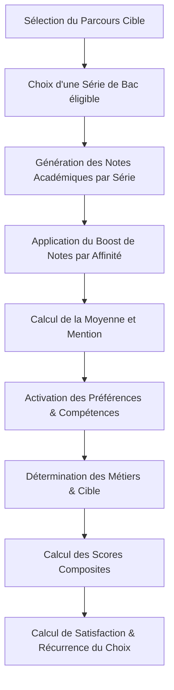

# Génération de Données Synthétiques — ORIENT'IA

Ce document décrit les règles et la méthodologie de génération des données synthétiques implémentées dans [generate_synthetic_data.py](file:///home/tovo/Bureau/cliniqueExam/data/synthetique/generate_synthetic_data.py). 

L'objectif principal est de produire un jeu de données de **400 profils** (260 étudiants et 140 professionnels) qui soit statistique-ment cohérent avec les critères réels de sélection et de satisfaction des parcours de l'ISPM (Madagascar).

---

## 1. Algorithme de Génération par Profil

Pour chaque profil, la génération suit les étapes ordonnées suivantes :

---

## 2. Règles de Cohérence et Distributions

### 2.1 Éligibilité des Séries de Baccalauréat
Chaque parcours n'accepte que des séries de baccalauréat spécifiques, conformément à la réglementation académique :
*   **Informatique / Génie / Physique-Chimie** (`esii`, `isaia`, `imticia`, `emii`, `gca`, `icmp`) : Séries **C**, **D** ou **S**.
*   **Agronomie / Sciences Naturelles** (`iaa`, `pip`, `aee`) : Séries **D**, **S** ou **C**.
*   **Littéraire / Langues** (`dtja`, `tee`, `teh`, `caa`) : Séries **A1**, **A2**, **L** ou **OSE**.
*   **Affaires / Économie / Gestion** (`fic`, `emp`, `iggia`) : Séries **OSE**, **S**, **C** (ou **A1**/**A2** pour `emp`).

### 2.2 Notes Scolaires (Distribution par Série)
Les notes sont générées via une distribution normale (Gaussienne) spécifique à chaque série :
*   **Série C** : Excellentes notes en Mathématiques ($\mu=16.5$, $\sigma=1.5$) et SPC ($\mu=15.5$, $\sigma=1.5$).
*   **Série S / D** : Bonnes notes scientifiques équilibrées. La série D est renforcée en SVT ($\mu=16.0$, $\sigma=1.5$).
*   **Séries A1 / A2 / L** : Excellentes notes en Français, Malagasy et Langues ($13.5 \le \mu \le 15.5$), Mathématiques basses.
*   **Série OSE** : Excellentes notes en SES ($\mu=15.5$, $\sigma=1.5$) et Histoire-Géographie.

### 2.3 Boost d'Affinité Académique
Si le parcours choisi enseigne une matière liée à une note scolaire, un **boost de +2.5 points** est appliqué à la moyenne gaussienne afin de simuler la réussite pré-existante de l'étudiant dans ce domaine d'intérêt.

---

## 3. Préférences, Compétences et Profilage Professionnel

### 3.1 Profilage Multi-hot (Matières, Compétences, Intérêts)
*   Les options de matières préférées, compétences, prérequis et centres d'intérêt sont issues de listes d'options fermées prédéfinies (`COMPETENCES_LIST`, `INTERETS_LIST`, `PREREQUIS_LIST`) pour éviter les saisies libres et simuler des choix guidés.
*   Les matières préférées, compétences possédées et centres d'intérêt sont activés selon les données réelles du parcours (`PARCOURS_DATA`) avec une probabilité de **75% à 80%**.
*   **Corrélation Forte Note $\to$ Préférence** : Une note $\ge 14/20$ dans une matière clé déclenche avec **85%** de probabilité l'activation des compétences et intérêts associés (ex. note élevée en mathématiques $\to$ compétences logiques et intérêt scientifique activés).

### 3.2 Métiers Visés et Reconversion Professionnelle
*   **Étudiants** : Un bruit de **15%** de désalignement est introduit pour simuler les étudiants indécis ou mal orientés.
*   **Professionnels (Reconversion)** : Un bruit de **10%** de désalignement entre le parcours d'études d'origine et le métier réellement exercé est simulé. Ce désalignement entraîne une pénalité systématique de satisfaction.

### 3.3 Ancienneté Professionnelle
*   **Ancienneté en mois (`anciennete_metier`)** : Pour les professionnels, l'ancienneté est modélisée sous forme d'un nombre entier de **mois**, borné par le temps maximal écoulé depuis l'obtention du diplôme (`annee_fin_etudes`) jusqu'à l'année courante (2026).
*   **Corrélation avec la Satisfaction** :
    *   Satisfaction élevée ($\ge 4$) : Ancienneté forte ($60\%$ à $100\%$ de la durée maximale).
    *   Satisfaction moyenne ($3$) : Ancienneté moyenne ($30\%$ à $70\%$ de la durée maximale).
    *   Satisfaction faible ($\le 2$) : Ancienneté faible ($1$ mois à $40\%$ de la durée maximale), simulant de l'instabilité ou une reconversion récente.

---

## 4. Genre et Représentativité
*   Une colonne **`sexe`** (`homme` / `femme`) est générée avec une distribution uniforme à 50/50.
*   Un **boost d'alignement par genre** (+0.5 point de satisfaction) est appliqué en fonction de l'affinité historique et des descriptions de parcours :
    *   **Femmes** : Parcours d'Affaires, Gestion, Droit, Tourisme et Agroalimentaire (`iggia`, `caa`, `fic`, `dtja`, `emp`, `teh`, `tee`, `iaa`).
    *   **Hommes** : Parcours techniques et d'ingénierie (travaux/mécanique, informatique pure, électronique, chimie) (`emii`, `esii`, `gca`, `imticia`, `isaia`, `icmp`, `pip`, `aee`).

---

## 5. Scores Composites
Quatre scores composites sont calculés à la volée :
1.  **Scientifique Dur** : Moyenne entre `note_mathematiques` et `note_spc`.
2.  **Scientifique Naturel** : Note brute de `note_svt`.
3.  **Littéraire** : Moyenne de `note_malagasy`, `note_francais`, `note_langue_vivante`, `note_hg` et `note_philosophie`.
4.  **Économique** : Moyenne de `note_mathematiques`, `note_ses` et `note_hg` (si SES existe).

---

## 6. Calcul de Satisfaction et Rétention

La satisfaction globale (échelle 1 à 5) est proportionnelle à la cohérence du profil :

$$\text{Satisfaction Initialisée} = 2.0 + (\text{Score Alignement Prolog} \times 0.4)$$

### 6.1 Bonus de Satisfaction (Conditions Favorables)
*   Série C dans les filières Informatique/Génie/Biotech (+0.5).
*   Série A1 dans les filières Littéraires/Affaires (+0.5).
*   Série OSE dans les filières Gestion/Économie (+0.5).
*   Moyenne générale élevée ($\ge 14/20$) ou notes excellentes ($\ge 15/20$) dans la matière pivot du parcours (+0.5).
*   Boost d'affinité par genre (+0.5).

### 6.2 Pénalités de Satisfaction (Conditions Défavorables)
*   Note dans la matière pivot inférieure au seuil critique de réussite (ex. note de mathématiques $< 12$ en informatique) : **-1.5 points**.
*   Moyenne générale trop basse : **-1.0 point**.
*   Professionnel travaillant hors de sa filière d'études (reconverti) : **-2.0 points**.

### 6.3 Récurrence du Choix (`referait_choix`)
La décision de refaire ou non le même parcours suit un schéma probabiliste corrélé à la satisfaction finale :
*   **Satisfaction = 5** $\to$ **95%** de "oui".
*   **Satisfaction = 4** $\to$ **85%** de "oui".
*   **Satisfaction = 3** $\to$ **70%** de "oui".
*   **Satisfaction $\le 2$** $\to$ **15%** de "oui".
